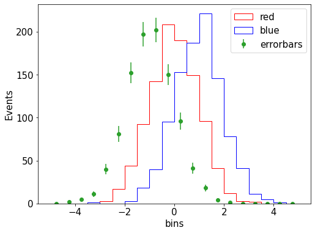
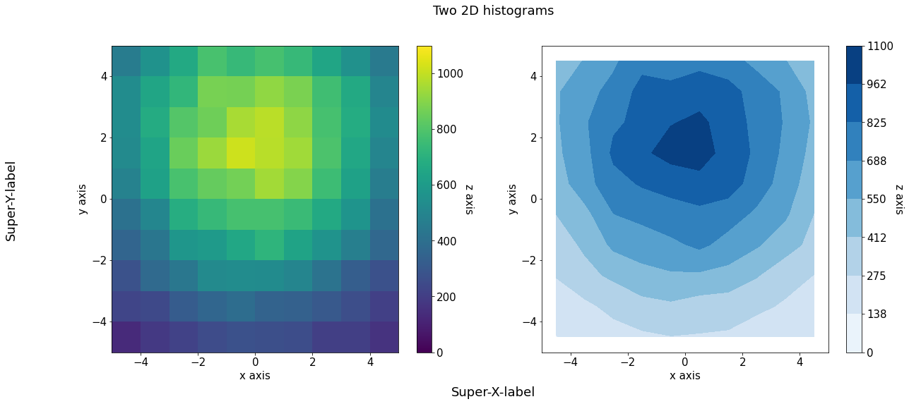

Plotting with MatPlotLib
=========


```python
import matplotlib.pyplot as plt
plt.rcParams.update({'font.size': 15})
import numpy as np
```

Histograms (1D, 2D), general formatting
========


```python
fig,ax = plt.subplots(figsize=(8,6))
a = np.random.normal(0,1,size=(1000))
b = np.random.normal(1,1,size=(1000))
ax.hist(a,bins=np.linspace(-5,5,21),edgecolor='red',histtype = 'step',fill=None,label='red');
ax.hist(b,bins=np.linspace(-5,5,21),edgecolor='blue',histtype = 'step',fill=None,label='blue');

# histogram with error bars
c = np.random.normal(-1,1,size=(1000))
n,bin_edges = np.histogram(c,20,[-5,5])
bin_centers = bin_edges[:-1] + np.diff(bin_edges) / 2
ax.errorbar(bin_centers,n,yerr=np.sqrt(n), fmt='o',label='errorbars')

# Labeling / legend options
ax.set(xlabel='bins', ylabel='Events')
# ax.set_xlabel('bins')
# ax.set_ylabel('Events')
ax.legend();
```


    

    


```python
fig,ax = plt.subplots(figsize=(8,6))
hist_2d = ax.hist2d(a,b,bins=[20,20])

# axes
fig.colorbar(hist_2d[3], ax=ax,label='z axis')
ax.set(xlabel='x axis', ylabel='y axis');
```


    

    


```python

```
