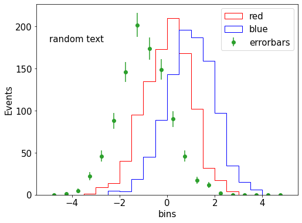

Plotting with MatPlotLib
=========

If you are looking for the Histo class, look for the matplotlibHistos package.


```python
import matplotlib.pyplot as plt
plt.rcParams.update({'font.size': 15})
import numpy as np
```

Histograms (1D, 2D), general formatting
========


```python
fig,ax = plt.subplots(figsize=(8,6))
a = np.random.normal(0,1,size=(1000))
b = np.random.normal(1,1,size=(1000))
ax.hist(a,bins=np.linspace(-5,5,21),edgecolor='red',histtype = 'step',fill=None,label='red');
ax.hist(b,bins=np.linspace(-5,5,21),edgecolor='blue',histtype = 'step',fill=None,label='blue');

# histogram with error bars
c = np.random.normal(-1,1,size=(1000))
n,bin_edges = np.histogram(c,20,[-5,5])
bin_centers = bin_edges[:-1] + np.diff(bin_edges) / 2
ax.errorbar(bin_centers,n,yerr=np.sqrt(n), fmt='o',label='errorbars')

# Labeling / legend options
ax.set(xlabel='bins', ylabel='Events')
# ax.set_xlabel('bins')
# ax.set_ylabel('Events')
ax.legend();

ax.text(0.05,0.8,'random text',transform=ax.transAxes)
```


    Text(0.05, 0.8, 'random text')


    

    


```python
fig,(ax1,ax2) = plt.subplots(1, 2,figsize=(20,8))
fig.suptitle('Two 2D histograms')
fig.supxlabel('Super-X-label')
fig.supylabel('Super-Y-label')
vmin,vmax = 0,1100
c = np.random.normal(0,4,size=(100000))
d = np.random.normal(2,4,size=(100000))

# Left axis: colorbar
hist_2d = ax1.hist2d(c,d,bins=[10,10],range=((-5,5),(-5,5)),vmin=0,vmax=1100)
fig.colorbar(hist_2d[3],ax=ax1).set_label('z axis',rotation=270,labelpad=15)
ax1.set(xlabel='x axis',ylabel='y axis');

# Right axis: contourf
x_centers = hist_2d[1][:-1] + np.diff(hist_2d[1] / 2)
y_centers = hist_2d[2][:-1] + np.diff(hist_2d[2] / 2)
X,Y = np.meshgrid(x_centers,y_centers)
levels = np.linspace(vmin, vmax, 9)
# Watch out -- you need SwapAxes for some reason!
my_contour = ax2.contourf(X,Y,np.swapaxes(hist_2d[0],0,1),cmap='Blues',vmin=vmin,vmax=vmax,levels=levels)
ax2.set(xlabel='x axis',ylabel='y axis');
ax2.set_xlim([-5,5])
ax2.set_ylim([-5,5])
fig.colorbar(my_contour).set_label('z axis', rotation=270,labelpad=15)
```


    

    


```python

```
